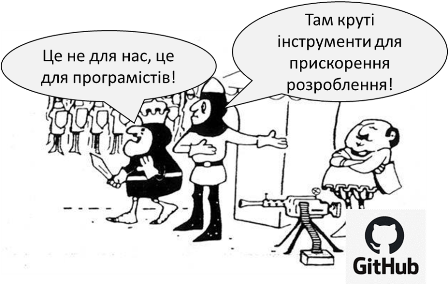

# Вебінар-воркшоп «Як почати користуватися GitHub для створення документів та сайту» 

Запрошую Вас на безкоштовний вебінар-воркшоп «Як почати користуватися GitHub для створення документів та сайту» 
Відбудеться 15.07.2022 о 10:00 - 12:00

На воркшопі Ви:

*   зареєструєтеся в системі GitHub
*   приймете участь в обговоренні (текстом) теми репозиторію   
*   створите свій власний репозиторій на GitHub
*   створите текстовий матеріал в репозиторії 
*   зробите Веб-вигляд для Ваших сторінок

Воркшоп орієнтований на 1 годину. 

Посилання на zoom.

Topic: Git4All

[https://us04web.zoom.us/j/73947950975?pwd=2ce-bXAfl42y-2SAj2FIvhHVYyDimL.1](https://us04web.zoom.us/j/73947950975?pwd=2ce-bXAfl42y-2SAj2FIvhHVYyDimL.1)

Meeting ID: 739 4795 0975

Passcode: geSgu7

Олександр Пупена
