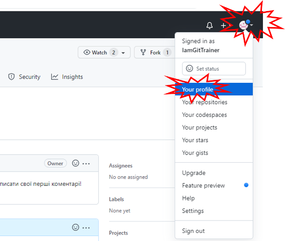

[На основну сторінку](../README.md)

# Як почати користуватися GitHub для створення документів та сайту 

За матеріалами безкоштовного вебінару-воркшопу «Як почати користуватися GitHub для створення документів та сайту»  який вдбувся 15.07.2022 о 10:00 - 12:00. 

Запис вебінару [за посиланням](https://youtu.be/0-4Qfg7YpQE).

Так, Ви не програміст. Ну або Ви програміст, але без Гітхабу Вам і так нормально працювалося. 

Ну, ок, принаймні Ви можете зареєструватися тут, це ж грошей не потребує. І тепер, коли Ваші колеги або друзі попросять Вас щось прокоментувати у своєму репозиторії, Ви вже будете мати свій аккаунт. А якщо Ви хочете публікувати якусь інформацію на просторах Вебу, то Вам таки точно варто принаймні спробувати. Все що наводиметься тут, ніяк не стосується програмування.    


Нижче наведена інструкція як:

*   зареєстрватися в системі GitHub
*   прийняли участь в обговоренні (текстом) теми репозиторію   
*   створити свій власний публічний репозиторій на GitHub
*   створити текстовий матеріал в репозиторії 
*   зробити Веб-вигляд для своїх сторінок
*   створити свій власний приватний репозиторій та запросити до нього колегу

## Реєстрація на GitHub 

Для виконання цього пункту необхідно:

- мати доступ до своєї електронної пошти 
- придумати пароль, що містить:
  - довжиною принаймні 8 символів
  - принаймні одну велику і одну малу літеру
  - принаймні одну цифру
  - принаймні один спец символ, наприклад `_`

- придумати ім'я користувача, наприклад ім'я та прізвище на латині, можливо з цифрами 


1) Зайдіть на сторінку GitHub https://github.com/
2) Натисніть `Sign Up` щоб зареєструватися, якщо у Вас ще немає облікового запису. Якщо Ви вже колись реєструвалися, то треба зайти під існуючим обліковим записом, тобто натиснути `Sign In` та переходити до наступного завдання.    


3) Введіть свою поштову адресу і натисніть `Continue`


4) Придумайте пароль, який містиме принаймні 8 літер, одну цифру, один особливий символ (`-`,`_`) і таке інше, принаймні одну маленьку і одну велику літеру. Запишіть цей пароль у поле вводу і натисніть `Continue`


5) У поле імені користувача `Enter username` введіть назву користувача одним словом, без пробілів і спец. символів. Треба добитися щоб внизу поля вводу з'явився напис  `<Ім'я користувача> is available` . Після цього натиснути `Continue`.


6) Далі Вам запропонують погодитися або відмовитися отримувати новини та оновлення через пошту. Можете написати `y`  або `n` і натиснути  `Continue`.


7) Далі запропонують пройти перевірку, чи Ви не робот. Натисніть `Перевірити` і виберіть картинки які Вам скажуть (в 2 кроки). 


8) Після проходження перевірки натисніть `Create account`


9) На наступному кроці Вам запропонують ввести перевірочний код, який Вам відправлять на пошту. Відкрийте пошту і введіть ті цифри, що Вам прийшли на пошту.   


10) На наступних сторінках треба ввести певну інформацію про себе. На першій сторінці виберіть як саме Ви будете використовувати репозиторій в команді, можете вибрати  `Just Me` і натиснути `Continue` 


11) Далі необхідно вибрати якими функціями плануєте користуватися. Наприклад `Project Management`.


12) Далі виберіть `Contnue for Free`, щоб вказати що Ви хочете вибрати безкоштовний план. 


13) Ну от і все! Тепер Ви вже з нами!


## Залишити коментар у відкритому репозиторії  

Репозиторії можна сприймати як сукупність файлів для певного проекту. Але в GitHub є ще додаткові інструменти для керування цим проектом. Наприклад, репозиторій Git4All наразі містить небагато файлів, але там можна задавати питання і обговорювати різноманітну проектну діяльність в напрямку використання GitHub в створенні документів. У цьому  пункті треба залишити коментар у загальному репозиторію. 

1)  У рядку пошуку GitHub введіть `git4all` для пошуку необхідного репозиторію і натисніть `All GitHub`


2) У знайденому буде різноманітні ресурси, серед яких репозиторії `GitHub`. Натисніть по `pupenasan/Git4All`.


3) Ви перейдете на мій (pupenasan) репозиторій, який призначено саме для тих, хто хоче використати GitHub для своєї діяльності, яка не пов'язана з програмуванням. Тут дуже багато різних вкладок, я відверто кажучи сам не знаю про більш ніж 50% від них, тим не менше я користуюся цією платформою. Передивіться ті частини, які виділені червоним на рисунку:
   - вгорі назва репозиторію яка складається 2 3-х частин: `користувач/назва`, зліва в назві значок і справа `Public` вказує на те, що цей репозиторій загальнодоступний і його може переглядати і коментувати будь хто з користувачів GitHub 
   - Нижче йдуть закладки, які надають різні можливості роботи з репозиторієм. Наразі нас цікавить:
     - `Code` - де відображається перелік файлів в репозиторії а для деяких файлів можна передивитися і зміст. За замовченням внизу відображається зміст файлу `README.md`
     -  `Issues`, `Discussions`  (остання з'явилася недавно, тому я навіть не знаю чим вона відрізняється, тому пишу про них разом) - дає можливість обговорювати проектну діяльність, тобто задавати питання, робити зауваження і т.п.    


4) Скористаємося обговореннями для створення першого повідомлення. Перейдіть в закладку `Issues` і натисніть по темі `Ласкаво просимо до клубу`.


4) Тепер можна залишити коментар. Напишіть певний текст в коментарі, представтеся, напишіть коротко що очікуєте від знайомства з GitHub. Текст можна форматувати з використанням спеціального формату `MarkDown`. Наприклад для товстого шрифту використовується дві зірочки праворуч і ліворуч від тексту (`**Олександр**`) . У рамках філософії проекту `Git4All` , знання  `MarkDown` - це одна з обов'язкових компетентностей, які треба набути в рамках роботи з GitHub. Але наразі можна не вникати в усі його подробиці, а просто скористатися кнопками меню для швидкого редагування, як показано на рисунку нижче. Після редагування, передивіться форматований результат, натиснувши `Preview` . 


5) Якщо результат задовольняє натисніть кнопку `Comment` , якщо ні на вкладці `Write` виправте текст на необхідний, після чого повторіть спробу. 


6) Вітаю! Ви залишили свій перший дуже важливий коментар. І тепер Ви зможете коментувати будь які відкриті проекти на просторах GitHub! У тому числі, можете задавати питання сюди, ми спробуємо допомогти. Але, є один ньюанс! Тепер Ви автоматично підписалися на відповіді в даній гілці. Тобто тепер, кожного разу, як хтось залишатиме коментар, Вам на пошту будуть приходити повідомлення. Щоб цього не відбувалося, треба відписатися, натиснувши `Unsubscribe` або вибравши відповідний пункт `Not subscribed` в меню `Notification` теми.  


## Налаштування власного профілю  

Звичайно, варто залишити про себе якусь інформацію, якщо Ви хочете щоб з Вами мали справу. Для цього треба заповнити свій профіль. Цим і займемося в цьому пункті.

1) Відкрийте налаштування свого профілю через пункт меню `Your profile`  в правому верхньому кутку.




2) У цьому вікні Ви побачите інформацію стосовно Вашого профілю, включаючи статистику дій, ваші проекти, репозиторії і т.п. Звісно, ще рано казати про якусь статистику, але не все одразу. 


На налаштування усіх властивостей профілю можна попасти різними способами. Найшвидше через меню `Settings`


3) Тепер виберіть фотографію для аватарки


4) Заповніть поля імені та натисніть кнопку `Update Profile`


5) Для виходу на основну сторінку натисніть котика в лівому верхньому кутку. До речі, цей котик є символом GitHub, якщо Ви не знали. 


## Створення свого власного відкритого репозиторію  

Прийшов час створити власний відкритий репозиторій, який буде доступний для перегляду і коментування усім охочим. Це може бути наприклад якийсь відкритий проект, до якого Ви хочете залучити усіх охочих. 

Репозиторій GitHub (і Git) - це сховище файлів та усіх його попередніх версій. Умовно його можна представити як папку з проектними файлами, старі версії яких за необхідності зміни, можуть зберігатися в схованій папці. Зараз особливості керування версіями та всі інші дуже важливі функції не будуть розглядатися, бо це наразі складно для 1-го разу. Просто вважатиме для простоти, що це така загальнодоступна папка з файлами.  

Давайте назвемо свій репозиторій `Мій перший репозиторій`, скорочено `myfirstrepo`. 

1) Перейдіть на основну сторінку (для цього погладьте котика мишкою). Натисніть `Create repository`


2) Заповніть основні поля: 

- назва - `mefirstrepo` 
- опис `Мій перший репозиторій`
- тип: `Public`, тобто може бачити і коментувати усі в системі  
- `Add Readme` - у репозиторій при створенні добавляється файл `README.md` який описує загальні властивості репозиторію.
- `Licenze MIT` - при такій ліцензії усі мають право поширювати зміст Вашого репозиторію кому завгодно, використовувати його у своїх цілях і т.п.

Натисніть `Create repository`. 


3) Вітаю, Ваш перший репозиторій створено. В ньому зараз всього два файли, один з яких `README.md` вже навіть відображається. Тепер давайте заповнимо його чимось.

   

   

## Створення документів в Markdown

Як я вже казав, якщо Ви хочете створювати текстовий контент в рамках запропонованого підходу, Вам прийдеться працювати з `MarkDown`. Ви вже з ним познайомилися, коли залишали коментар. Тепер прийшов час створити перший документ з використанням цього формату. Так, я розумію, що писати текст з якимось спец символами для форматування це не понашинськи, це для програмістів. Тому для цих справ я припас пару інструментів. З першим ми познайомимося сьогодні, він онлайновий (є купа подібних в Інтернеті, це кращий з першої десятки, що я знайшов). Отже - поїхали.

1)  Відкрийте онлайн редактор MarkDown <https://onlinemarkdowneditor.dev>. У редакторі вже буде набраний для прикладу документ. Використовуючи кнопку `Source` переключіться в режим ресурсу, щоб передивитися вигляд деяких елементів.    


2) Натисніть `Ctrl+A` щоб виділити весь зміст вікна. Натисніть `Delete` та видаліть весь зміст. Далі наберіть наступний зміст:

```
Про репозиторій
Це мій перший репозиторій, який:
- має документи в форматі MarkDown
- документи також містять рисунки і лінки на відео 
```

Використовуючи кнопки форматування на панелі інструментів відформатуйте текст, як показано на рисунку.  


3) Переключіться на режим ресурсу `Source` і скопіюйте сирцевий текст в буфер обміну. Перейдіть на свій репозиторій і включіть редагування. 


4) Вставте скопійований текст. Перейдіть в режим `Preview` для перегляду форматованого тексту. Натисніть `Commit changes` щоб зміни вступили в силу (що насправді значить ця команда розглянемо іншим разом).


4) Перейдіть в корінь репозиторію і натисніть `AddFile -> Create New File` для створення нового файлу.


5) Використовуючи вже відомий онлайн редактор створіть опис свого хоббі та вставте туди рисунок зі свого ПК. Скопіюйте зміст в новостворений файл на назвіть його `hobby.md`. Використовуючи `Preview` проконтролюйте щоб вигляд його був правильний. Натисніть `Commit New File`  


6) Тепер у Вас в репозиторії є ще один файл md (MarkDown). Але в його змісті є посилання на зовнішній рисунок. Варто його розмістити в цьому репозиторію і змінити лінк на нього. Для цього добавте цей файл рисунку у свій репозиторій. 


Після добавлення натисніть `Commit Changes`.


7) Тепер відкрийте `hobby.md` і переключіться в його редагування.


8) Змініть посилання так, щоб вказівка була на завантажений файл. Використовуючи `Preview` проконтролюйте, що все відображається коректно `commit changes`.

```

```


Тепер Ви навчилися створювати файли в форматі `MarkDown`. "А що це мені дає?" - слушно спитаєте Ви.  "Адже є різні Google Document, які роблять редагування набагато простіше". Так, не поспориш з цим. Але ми тільки починаємо знайомитися з можливостями MarkDown. У випадку командної роботи створення документів можна розподілити між розробниками, а потім робити "збірку" в єдиний документ. Або одразу робити його "живим" і змінним, але це ми потім розберемо. Зараз зробимо з нашого репозиторію Веб-сайт.

## Створення веб-сайту на базі власного відкритого репозиторію  

З відкритих репозиторіїв можна робити Веб-сайти. Що для цього треба? Просто поставити галочку в потрібному місці.

1) Зайдіть в налаштування репозиторію `Settings`

 

2) Далі перейдіть на розділ `Pages`


3) У ресурсах звідки буде формуватися веб-сайт вкажіть основну гілку `main`. Після цього натисніть `Save`


4) Можна також вибрати тему оформлення. Зараз це робиться через створення в репозиторії файлу `_config.yml` , з налаштуванням стилю, наприклад  з наступним змістом:

```yaml
theme: jekyll-theme-leap-day
```

Раніше (як на відео) можна б було вибрати тему оформлення прямо в налаштуваннях через `Choose a theme` далі вибрати `Leap Day` і `Select Theme`.


5) Ну от і все, сайт тепер доступно за посиланням, яке вказано на сторінці налаштування. Воно має наступну адресу за замовченням. Відкрийте посилання в новому вікні. Якщо там немає нічого, почекайте кілька хвилин, і обновіть стоірнку.  Там має бути зміст Вашого файлу README але вже в форматі веб-сторінки.

```http
https://імякористувача.github.io/назварепозиторія/
```


6) Тепер увесь Ваш зміст репозиторію кожного разу при зміні буде публікуватися на веб сайті. Звісно для цього потірібен час, а при публікації можуть виникати помилки. Для простих сайтів, зроблених на базі ваших файлів MarkDown малоймовірно що сайт не опублікується. Але щоб знати це достовірно, варто подивитися на результат виконання публікації.  Для цього треба перейти на вкладку `Actions`. Як видно, з рисунку в моєму репозиторію сайт успішно опублікувався два рази, про що свідчить зелена галочка. Під час публікації індикатор буде виглядіти "як в прогресі", якщо публікація не вдалася, то він буде червоним з відповідним написом. Клікнувши по запису можна подивитися деталі, але це явно не тема нашого теперішнього заняття.


7) У нас два файли а ми бачимо тільки одну сторінку. Давайте зробимо зміни і вставим в основний файл README, посилання на сторінку `hobby.md`.  Для цього перейдемо на вкладку з кодом і перейдемо в режим редагування.


8) Прості зміни в тексті зробимо власними силами, без використання сторонніх редакторів. Змініть сторінку, добавивши туди текст:

```
### Про себе
- [Хоббі](hobby.md)
```

Використайте `Preview` для перегляду, після чого натисніть `Commit Changes`


9) Перейдіть на вкладку `Actions` там повинен бути показаний прогрес виконання процесу розгортання. Дочекайтеся завершення і обновіть веб-сторінку розгорнутого сайту. 


Ура! Тепер Ви вмієте на базі GitHub будувати власні сайти з публічним доступом.

Якщо Ви хочете робити свої проекти в команді, але без доступу інших, Вам до наступного пункту. 

## Створення свого власного приватного репозиторію  

Приватний репозиторій надає доступ тільки для запрошених до нього співавторів. При цьому можна налаштувати так, щоб тільки певні користувачі мали можливість зміни його змісту. У безкоштовній підписці немає можливості будувати сайти на базі приватних репозиторіїв, але вони для цього і не призначені.

1) У лівому кутку натисніть `New` для створення нового репозиторію. Назвіть його `firstprivete`, виставте налаштування, як показано на рисунку. Не забудьте вибрати опцію `Private`. 

  


2) Все. Репозиторій створено. Тепер там можна робити те саме, що і у публічних репозиторіях (є звичайно певні обмеження). Але крім Вас більше ніхто не має до нього доступу. Запросіть до репозиторію когось із зареєстрованих на платформі GitHub знайомих. Наприклад когось тих, хто відмітився в обговоренні на першому завданні, або мене :-). Припустимо запрошення треба відправити мені (очікую на массу запрошень ;-) .

Натисніть на котика і виберіть того, кого Ви хочете запросити і скопіюйте його імя.


3) Перейдіть знову до свого репозиторію (Спробуйте самостійно, не забувайте що для цього треба гладити котика). Зайдіть на закладку `Settings -> Collaborators`


4) Враховуючи що Ви зайшли до зони підвищеного контролю, GitHub заставить Вас повторно ввести пароль. Добре що браузер його запам'ятав (чи ні?)


4) Після вводу паролю,  натисніть `Add people` .

 

5) Тепер треба ввести ім'я користувача, вибрати його і відправити запрошення. Перелік запрошених і добавлених користувачів відображається в цьому вікні. Тепер треба чекати поки користувач підтвердить запрошення.


6) Вибраному користувачу прийде на пошту запрошення, яке він повинен відкрити і підтвердити.


Тепер над даним репозиторієм працюють два користувачі. Звісно цей самий принцип працює і для відкритих репозиторіїв, якщо Ви хочете добавити туди когось для редагування.

7) Попросіть користувача створити якийсь файл в репозиторії, наприклад `імякористувача.md`. Добавлений в репозиторій файл буде відображатися у вашому. 

Олександр Пупена
